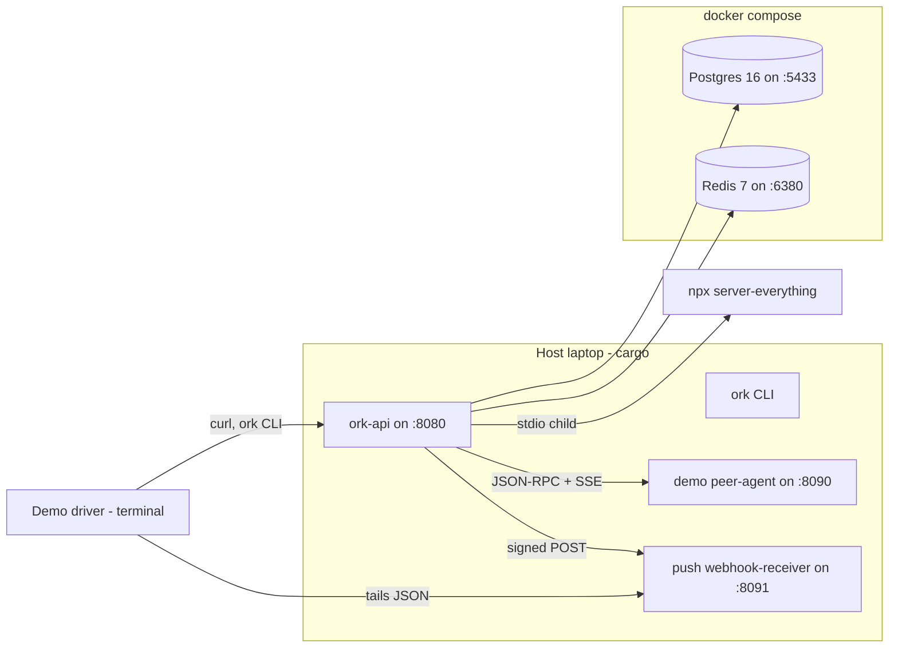

# ork kitchen-sink demo

A self-contained, ~15-minute walk-through that boots the entire ork stack on
a laptop and exercises every wired ADR (0001-0010) end-to-end. Designed for a
mixed audience: engineers can read the JSON in the terminal, stakeholders can
follow this README and watch the same output scroll past in their pair's
window.

The whole thing lives under `demo/` plus three tiny shims (root `Makefile`,
two new isolated cargo binaries under `demo/peer-agent/` and
`demo/webhook-receiver/`). Nothing under `crates/` had to change.

## TL;DR

```bash
# from the repo root
export MINIMAX_API_KEY="Bearer sk-..."   # literal Authorization header value, only needed for stage 4
export GITHUB_TOKEN=...                  # only needed for stage 1
make demo                                # everything: stage 0 -> stage 8
```

If you want to drive each stage by hand (recommended for the first run, so
you can read the output):

```bash
make demo-up                 # boot infra + ork-api (stage 0 only)
make -C demo demo-stage-1    # ...
make -C demo demo-stage-7
make demo-down               # stage 8 cleanup
```

## Prerequisites

| Tool | Why | How to check |
| --- | --- | --- |
| Docker + compose plugin | Postgres + Redis containers | `docker compose version` |
| Rust toolchain (workspace pinned) | builds `ork-api`, `ork-cli`, demo binaries | `cargo --version` |
| `jq` | every stage script pretty-prints JSON | `jq --version` |
| `curl` | every HTTP interaction | `curl --version` |
| `openssl` | mints the demo's HS256 JWT (stage 0) | `openssl version` |
| `yq` (mikefarah) **or** `python3` + `PyYAML` *(optional)* | YAML → JSON for workflow defs (stages 4 + 6); pre-baked JSON snapshots ship under `demo/workflows/` so the demo runs without either | `yq --version` |
| Node.js 20+ / `npx` | spawns the MCP `server-everything` child + (stage 5) | `node --version` |
| `MINIMAX_API_KEY` env var | demo's `default_provider` is `minimax` (see [`demo/config/default.toml`](config/default.toml)) and reads its key from this env var. Per [ADR 0012](../docs/adrs/0012-multi-llm-providers.md), header values are sent verbatim — no implicit `Bearer ` prefix — so this MUST be set to the **literal Authorization header value** (e.g. `export MINIMAX_API_KEY="Bearer sk-…"`). A bare key surfaces as `401 Unauthorized — Please carry the API secret key in the 'Authorization' field` from Minimax. Swap in any OpenAI-compatible endpoint by editing `[[llm.providers]]`. Needed for stage 4. | `echo $MINIMAX_API_KEY` |
| `GITHUB_TOKEN` env var | optional; powers `ork standup` against a real repo (stage 1) | `gh auth status` |

The demo uses host ports `8080` (`ork-api`), `8090` (peer), `8091` (push
receiver), `5433` (Postgres), `6380` (Redis). Override the first three with
`PEER_ADDR=…` / `RECEIVER_ADDR=…` env vars if you have collisions; for the
container ports edit `demo/docker-compose.yml` and the matching URLs in
`demo/config/default.toml`.

## Demo stack architecture



In-memory eventing is used (`[kafka].brokers = []` in
`demo/config/default.toml`), so no Kafka is needed in compose. The MCP
servers are spawned as stdio children of `ork-api`, so no extra container
either.

## The 8-stage walkthrough

Each stage is one `make -C demo demo-stage-N` target so it can be paused,
replayed, or skipped independently. Golden outputs (header trimmed) live
under [`demo/expected/`](expected/); the snippets in each section below are
reproduced from those files.

### Stage 0 — Bootstrap (infra + ork-api)

What it does: `docker compose up -d`, waits for healthchecks, applies every
file under [`migrations/`](../migrations/) to the demo Postgres, seeds a
tenant via `POST /api/tenants`, mints an HS256 JWT, writes `demo/.env`, then
launches `ork-api` under `nohup` writing to `demo/logs/ork-api.log`.

```bash
make -C demo demo-stage-0
```

Expected (excerpt):

```
== Stage 0 — Bootstrap ==
[info] applying 001_initial_schema.sql
... (migrations)
[info] launching ork-api on 127.0.0.1:8080  (logs -> demo/logs/ork-api.log)
[info] tenant id: 8b2c0e92-3c8d-4d78-b8b7-1f4ad1a3a9d2
[info] JWT minted (HS256, 24h, scopes=admin,a2a:read,a2a:write,workflow:read,workflow:write)
[info] wrote demo/.env (TENANT_ID, JWT, BASE_URL)
```

ADR cross-links: infra (no specific ADR). Touches the persistence layer
covered by [`docs/adrs/0001-architecture-overview.md`](../docs/adrs/0001-architecture-overview.md).

### Stage 1 — `ork standup` (CLI + integrations, no LLM required)

What it does: runs

```bash
cargo run -q -p ork-cli -- standup tokio-rs/tokio --hours 168 --raw
```

against the live GitHub API. Override the repo with `STANDUP_REPO=owner/repo`.
Without `GITHUB_TOKEN` the script exits 0 with a friendly skip.

```bash
make -C demo demo-stage-1
```

Expected output: see [`demo/expected/stage-1.txt`](expected/stage-1.txt).

ADR cross-links: [`0002-cli-architecture.md`](../docs/adrs/0002-cli-architecture.md)
(CLI surface), and the GitHub adapter under
[`crates/ork-integrations/src/github`](../crates/ork-integrations/src/github).

### Stage 2 — Agent cards + registry (ADR 0003 + 0005)

What it does: `curl`s

- `GET /.well-known/agent-card.json` (public, default agent = planner),
- `GET /a2a/agents/{id}/.well-known/agent-card.json` for each built-in role,
- `GET /a2a/agents` (protected — needs the JWT).

```bash
make -C demo demo-stage-2
```

Expected (excerpt):

```
[
  { "name": "Planner",     "version": "0.1.0", "streaming": true, "push": true, "skills": 2 },
  { "name": "Researcher",  "version": "0.1.0", "streaming": true, "push": true, "skills": 2 },
  { "name": "Writer",      "version": "0.1.0", "streaming": true, "push": true, "skills": 2 },
  { "name": "Reviewer",    "version": "0.1.0", "streaming": true, "push": true, "skills": 2 },
  { "name": "Synthesizer", "version": "0.1.0", "streaming": true, "push": true, "skills": 1 }
]
```

ADR cross-links: [`0003-a2a-wire-types.md`](../docs/adrs/0003-a2a-wire-types.md),
[`0005-card-publishing-and-discovery.md`](../docs/adrs/0005-card-publishing-and-discovery.md).
The five default cards come from
[`crates/ork-agents/src/roles.rs`](../crates/ork-agents/src/roles.rs).

### Stage 3 — `message/stream` + SSE replay (ADR 0008)

What it does:

1. POSTs a JSON-RPC `message/stream` request to `/a2a/agents/planner` with
   `curl --max-time 2` so curl drops the connection mid-stream.
2. Parses the `task_id` out of the captured SSE chunks.
3. Reconnects to `GET /a2a/agents/planner/stream/{task_id}` — the server's
   replay buffer should serve the same events back.

Does **not** need `MINIMAX_API_KEY`: even if the LLM call fails the
dispatcher emits at least a `Working` status update before terminating,
which is enough for the replay buffer.

```bash
make -C demo demo-stage-3
```

Expected (excerpt):

```
event: message
id: 0
data: {"jsonrpc":"2.0","id":"demo-stream-1","result":{"task_id":"5b8e91d4-...","kind":"status_update","status":{"state":"Working", ...},"final":false}}
...
[info] captured task id: 5b8e91d4-2c4f-4b53-8b9c-3e8e3f7a1d12
[info] GET http://127.0.0.1:8080/a2a/agents/planner/stream/5b8e91d4-...
[info] replay returned 4 data chunks: ...
```

ADR cross-link: [`0008-a2a-server-endpoints-and-sse.md`](../docs/adrs/0008-a2a-server-endpoints-and-sse.md).

### Stage 4 — Multi-step workflow run

What it does:

1. Compiles a JSON form of [`workflow-templates/change-plan.yaml`](../workflow-templates/change-plan.yaml).
   Because the canonical YAML's last step uses a `delegate_to:` hop that
   the engine currently FK-rejects (see "Known engine gaps" below), the
   demo ships a slimmed-down 5-step JSON snapshot at
   [`demo/workflows/change-plan.json`](workflows/change-plan.json) which
   drops the `delegate_to:` block but keeps every other step.
2. POSTs the definition to `POST /api/workflows`.
3. Starts a run with `POST /api/workflows/{id}/runs` and an
   `input.task = "..."` payload.
4. Polls `GET /api/runs/{id}` every 2s, prints status transitions, surfaces
   any per-step `error`, then prints the markdown the `write_plan` step
   produced and the reviewer verdict.

What this exercises: `agent` steps, sequential `depends_on`, the
`for_each` loop in `research_repos`, and the planner's tool plane
(`list_repos` + `code_search` + `read_file` + `list_tree`).

The default `input.task` asks the agents to plan a "client-side request
rate limiter" feature on the **anthropic-sdk-typescript** repository
configured under `[[repositories]]` in
[`demo/config/default.toml`](config/default.toml). The repo is real, so
the planner's `list_repos` returns a real entry, `code_search` runs
ripgrep over a real clone, and the writer produces a markdown plan
grounded in real file paths. Override the task via
`WORKFLOW_TASK="<your prompt>" make -C demo demo-stage-4`.

This stage needs `MINIMAX_API_KEY`. Without it the script exits 0 with a
hint.

```bash
export MINIMAX_API_KEY=...
make -C demo demo-stage-4
```

Expected output: see [`demo/expected/stage-4.txt`](expected/stage-4.txt).

ADR cross-link: workflow engine in
[`crates/ork-core/src/workflow`](../crates/ork-core/src/workflow). For
the `delegate_to:` semantics see
[`0006-peer-delegation-model.md`](../docs/adrs/0006-peer-delegation-model.md)
— but bear in mind it isn't currently runnable end-to-end (next section).

### Stage 5 — MCP tool plane (ADR 0010)

What it does:

1. Greps `demo/logs/ork-api.log` for the MCP refresh-loop banner — proves
   `ork-api` was booted with `[mcp].enabled = true` and that
   `CompositeToolExecutor::with_mcp` was applied at startup.
2. Prints the `[[mcp.servers]]` block from `demo/config/default.toml` so the
   audience sees the two stdio children configured (`everything` and
   `local-fs`).
3. Re-runs the `ork-mcp` integration test
   [`stdio_everything_server`](../crates/ork-mcp/tests/stdio_everything_server.rs)
   which spawns `npx -y @modelcontextprotocol/server-everything stdio` and
   round-trips `mcp:everything.echo` through the very same `McpClient`
   ork-api uses.

```bash
make -C demo demo-stage-5
```

Expected output: see [`demo/expected/stage-5.txt`](expected/stage-5.txt).

> Why a `cargo test` instead of an HTTP call into the planner? `LocalAgent`
> currently runs only the tools listed in its `AgentConfig`, which doesn't
> include MCP tools by default. Driving the canonical MCP code path through
> the integration test is the clearest demo without monkey-patching the
> agent registry.

ADR cross-link: [`0010-mcp-tool-plane.md`](../docs/adrs/0010-mcp-tool-plane.md).

### Stage 6 — Federation via vendor-planner peer (ADR 0007)

What it does:

1. Builds + boots [`demo/peer-agent`](peer-agent/) on `:8090` (a ~150-line
   axum binary that re-uses `ork-a2a` types). It serves an `AgentCard` at
   `/.well-known/agent-card.json` and a JSON-RPC `message/send` handler
   that returns a fixed `Task` envelope.
2. Confirms `ork-api` registered the peer via the
   `[[remote_agents]]` block in `demo/config/default.toml`.
3. Posts the [`demo/workflows/federation-demo.yaml`](workflows/federation-demo.yaml)
   workflow (two steps, both targeting `vendor-planner`), runs it, polls
   until terminal. This exercises ADR 0007 — every "thinking" hop is
   served by the stub peer over JSON-RPC `message/stream` so the demo
   doesn't burn LLM tokens.
4. Tails `demo/logs/peer-agent.log` to show the request actually arrived
   at the peer.

```bash
make -C demo demo-stage-6
```

Expected output: see [`demo/expected/stage-6.txt`](expected/stage-6.txt).

ADR cross-links: [`0007-remote-a2a-agent-client.md`](../docs/adrs/0007-remote-a2a-agent-client.md),
[`0006-peer-delegation-model.md`](../docs/adrs/0006-peer-delegation-model.md).

### Stage 7 — Push notifications + key rotation (ADR 0009)

What it does:

1. Builds + boots [`demo/webhook-receiver`](webhook-receiver/) on `:8091`
   (another ~100-line axum binary). It accepts `POST /hook`, parses the
   detached JWS in `X-A2A-Signature`, JSON-decodes the body, and persists
   the last 10 deliveries to `demo/.last-hooks.json`.
2. `GET /.well-known/jwks.json` to capture the initial `kid` set.
3. Kicks off `message/stream` against the planner, extracts the freshly
   minted `task_id`, and **immediately** POSTs
   `tasks/pushNotificationConfig/set` with the receiver's URL. This is a
   best-effort race: when the planner's LLM call fails fast (e.g. no
   `MINIMAX_API_KEY`) the task may terminate before the config is
   registered. The script tolerates an empty receiver state.
4. Forces a fresh ES256 signing key via
   `cargo run -q -p ork-cli -- admin push rotate-keys`.
5. Reads `a2a_signing_keys` directly out of demo Postgres to show the new
   row (with `previous_kid`'s `rotated_out_at` stamped) — that's the
   ground truth.
6. Re-fetches `/.well-known/jwks.json`. The currently running ork-api
   caches its `JwksProvider` snapshot in-process and only reloads on its
   own tick, so the published JWKS may still show the pre-rotation kid;
   subscribers will pick up the new key on the next refresh tick or
   server restart. Run `make demo` again for a clean view.

```bash
make -C demo demo-stage-7
```

Expected output: see [`demo/expected/stage-7.txt`](expected/stage-7.txt).

ADR cross-link: [`0009-push-notifications.md`](../docs/adrs/0009-push-notifications.md).

> The headline of stage 7 is the **JWKS rotation** — that part is
> deterministic. The live JWS delivery is best-effort and depends on how
> long the planner's task spends in `Working` before it terminates. With
> `MINIMAX_API_KEY` set, the LLM call usually takes long enough for the
> push config to be registered before the terminal event fires.

### Stage 8 — Teardown

What it does: kills the `ork-api`, peer-agent and webhook-receiver
processes (PID files under `demo/`), `docker compose down -v --remove-orphans`,
and removes `demo/.env`, `demo/logs/`, `demo/data/`, `demo/.last-hooks.json`.

Idempotent — safe to run twice in a row or mid-demo.

```bash
make demo-down                  # alias for `make -C demo demo-stage-8`
```

## Troubleshooting

- **Port already in use** — the demo claims host ports `8080`, `8090`,
  `8091`, `5433`, `6380`. For the cargo-launched binaries override with
  `PEER_ADDR=127.0.0.1:9090 make -C demo demo-stage-6`. For the docker
  ports, edit `demo/docker-compose.yml` and the matching URLs in
  `demo/config/default.toml`.
- **`MINIMAX_API_KEY` not set** — stage 4 exits 0 with a hint and stage 7's
  live push half is skipped. The other six stages still run end-to-end.
- **`npx` missing** — stage 5's live MCP round-trip is skipped (the boot
  evidence half still runs). Install Node.js 20+ to enable it.
- **`yq` missing** — both YAML-driven stages ship pre-generated JSON
  snapshots under `demo/workflows/`, so stages 4 and 6 work on a stock
  macOS box without `yq` or PyYAML. The snapshots are kept in sync with
  the source YAML by hand; if you edit `workflow-templates/change-plan.yaml`
  or `demo/workflows/federation-demo.yaml`, regenerate the matching
  `*.json` (`yq -o json '.' file.yaml > file.json` or
  `python3 -c "import json,yaml; json.dump(yaml.safe_load(open('file.yaml')), open('file.json','w'), indent=2)"`).
- **Stage 7 JWKS shows the old `kid` after rotation** — expected. The
  running `ork-api` caches the `JwksProvider` snapshot in-process. The
  rotation IS persisted (the script prints the new row out of
  `a2a_signing_keys`); subscribers see it on the next refresh tick or
  after restart.
- **`docker compose down -v` doesn't drop the Postgres volume** — the
  named volume is `ork-demo_pgdata`. Run
  `docker volume rm ork-demo_pgdata` to nuke a stuck data dir.
- **Stage N can't find demo/.env** — every script except stage 0 reads it.
  Re-run `make -C demo demo-stage-0` and try again.
- **`cargo build` rebuilds the world on every stage** — that's fine; the
  per-stage scripts use `cargo run -q` and rely on Cargo's incremental
  cache. Subsequent runs are sub-second.

## What this demo deliberately does NOT show

These map to ADRs that are still "Proposed" or features explicitly deferred
in [`docs/adrs/0010-mcp-tool-plane.md`](../docs/adrs/0010-mcp-tool-plane.md):

- Web UI (ADR 0017) — not implemented.
- Kong / Kafka in front (ADR 0004) — replaced by direct localhost +
  in-memory eventing for the demo.
- Multi-LLM (0012), gateways (0013), plugins (0014), embeds (0015), artifacts
  (0016), DAG enhancements (0018), schedules (0019), RBAC (0021), full
  observability (0022).
- MCP `resources` / `prompts`, real envelope encryption for MCP secrets,
  per-agent allow-list globs.

### Known engine gaps surfaced while building the demo

- ~~**`delegate_to:` workflow steps FK-violate `a2a_tasks_parent_task_id_fkey`.**~~
  Resolved. `WorkflowEngine::execute_agent_step` and
  `execute_delegated_call` now insert their parent `a2a_tasks` row before
  the agent runs, so `agent_call` / `peer_*` / `delegate_to:` child
  inserts satisfy the FK. See
  `crates/ork-core/tests/engine_persists_parent_task.rs` for the
  regression. The bundled `change-plan.json` snapshot still drops the
  `delegate_to:` block on the `review` step for now, but only because the
  YAML compiler path needs a separate refresh; the canonical
  `workflow-templates/change-plan.yaml` is otherwise the source of truth
  again.
- ~~**Agents `peer_<self>_*`-delegated and tripped the cycle detector mid-step.**~~
  Resolved. The catalog used to advertise every agent's full peer skill
  list back to *itself*; an LLM driving e.g. `synthesizer` would then
  pick `peer_synthesizer_default`, the first hop succeeded, the inner
  synthesizer made the same call, and the depth-1 chain caught the cycle
  with `OrkError::Workflow` — a *fatal* error that killed the whole
  step. Two-part fix: (a) `ToolCatalogBuilder::for_agent` now filters
  `peer_<self>_*` out of the calling agent's catalog so the LLM never
  sees self as a peer; (b) `AgentContext::child_for_delegation`
  cycle/depth rejections moved from `OrkError::Workflow` (fatal) to
  `OrkError::Validation` (recoverable per ADR-0010), so even if the LLM
  free-types `agent_call(agent="self")` it gets the error back as a tool
  result and can self-correct. Regressions:
  `crates/ork-agents/src/tool_catalog.rs::builder_does_not_advertise_self_peer_tools`
  and the updated cycle/depth tests in
  `crates/ork-core/src/a2a/context.rs` /
  `crates/ork-core/tests/delegation_step_cycle_cap.rs`.
- ~~**Workflow cascades past a failed step and the demo polling loop times out.**~~
  Resolved (incident
  [`docs/incidents/2026-04-25-workflow-cascades-past-failed-step.md`](../docs/incidents/2026-04-25-workflow-cascades-past-failed-step.md)).
  Three coordinated fixes: (a) the compiler now emits
  `EdgeCondition::OnPass` for `depends_on` edges, so a failed parent
  no longer fires its children with bogus `{{parent.output}}` —
  authors who want a fan-out-on-failure path declare it explicitly via
  `condition.on_fail`; (b) `WorkflowEngine` step lifecycle `info!` /
  `warn!` events now carry `run_id`, so `tail -F demo/logs/ork-api.log
  | jq 'select(.fields.run_id == "...")'` actually filters down to one
  run; (c) `OpenAiCompatibleProvider::chat_stream` retries once on
  transient initial-send (`request failed: error sending request for
  url`, including TCP/TLS reset and 5xx) *and* mid-stream truncation
  (`stream read failed: error decoding response body`) failures, but
  only before any SSE event has been forwarded to the consumer and
  only when the prior attempt was not a 4xx. Initial-send and
  mid-stream retries share a single `STREAM_MAX_ATTEMPTS = 2`
  budget. Regressions:
  `crates/ork-core/tests/engine_failed_step_does_not_cascade.rs` and
  `crates/ork-llm/tests/openai_compatible_stream_retry.rs`.
- **`/.well-known/jwks.json` lags behind `admin push rotate-keys`.** The
  `JwksProvider` snapshot inside `ork-api` only refreshes on its own tick;
  the CLI rotates in a separate process. Stage 7 reads the
  `a2a_signing_keys` table directly to show the rotation actually
  happened. Subscribers see the new `kid` after `ork-api` restarts (or on
  the next refresh tick).

## File layout

```
demo/
├── Makefile                 # per-stage targets
├── README.md                # this file
├── docker-compose.yml       # Postgres + Redis only
├── config/
│   ├── default.toml         # overlays the workspace config/default.toml
│   └── peer.toml            # stub vendor-planner identity
├── scripts/
│   ├── stage-0-bootstrap.sh ... stage-8-teardown.sh
│   └── lib.sh               # shared helpers (mint-jwt, wait-for, etc.)
├── workflows/
│   └── federation-demo.yaml # used by stage 6
├── peer-agent/              # stub remote A2A peer (cargo, isolated)
├── webhook-receiver/        # push notification receiver (cargo, isolated)
├── expected/                # golden output snippets per stage
└── (runtime) .env, logs/, data/, .last-hooks.json, .*.pid
```

The runtime artefacts (`.env`, `logs/`, `data/`, `.*.pid`,
`.last-hooks.json`) are created by stages 0/6/7 and removed by stage 8.
They are git-ignored.
