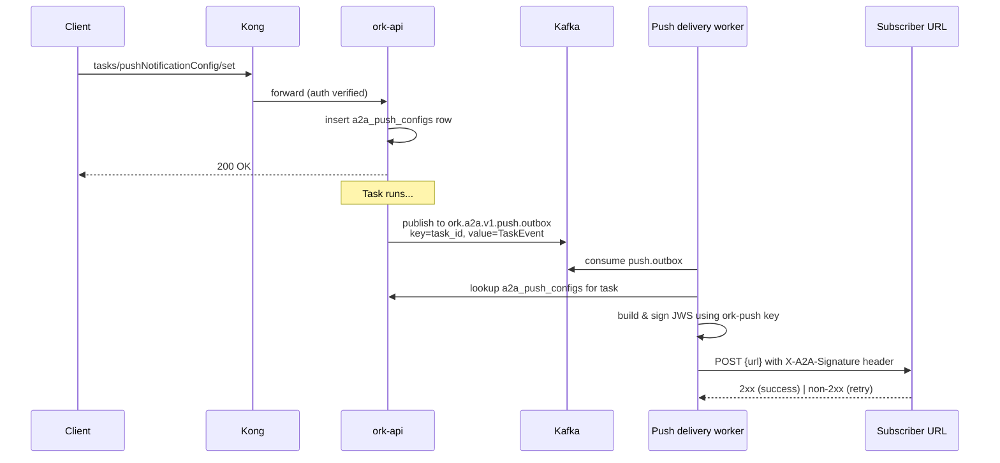

# 0009 — Push notifications and webhook signing

- **Status:** Proposed
- **Date:** 2026-04-24
- **Phase:** 2
- **Relates to:** 0003, 0004, 0006, 0008, 0017, 0020, 0022

## Context

A2A defines a **push notification** mechanism that lets clients register a callback URL to be called when a long-running task transitions state — without having to keep an SSE stream open. The relevant JSON-RPC methods are `tasks/pushNotificationConfig/set` and `tasks/pushNotificationConfig/get` (mounted by ADR [`0008`](0008-a2a-server-endpoints.md)).

Push notifications are critical for two ork use cases:

1. **Fire-and-forget peer delegation** (`agent_call(..., await: false)` in ADR [`0006`](0006-peer-delegation.md)) — the calling agent wants the result delivered later without blocking.
2. **Long-running workflows triggered by external systems** — e.g. a partner's CI system kicks off a release-notes workflow and wants ork to call back when done, exactly like the existing [`webhooks::pipeline_webhook`](../../crates/ork-api/src/routes/webhooks.rs) flow but in the outbound direction.

ork already terminates inbound webhooks at [`crates/ork-api/src/routes/webhooks.rs`](../../crates/ork-api/src/routes/webhooks.rs); this ADR adds the **outbound** side and makes it spec-conformant for A2A.

SAM provides the analog through [`common/utils/push_notification_auth.py`](https://github.com/SolaceLabs/solace-agent-mesh/blob/main/src/solace_agent_mesh/common/utils/push_notification_auth.py): JWT-signed callbacks with JWKS publication.

## Decision

ork **implements A2A push notifications as a Kafka-backed outbox plus a HTTP delivery worker**, with JWS signing and a JWKS endpoint for verification.

### Schema

A new table in `migrations/002_a2a_tasks.sql` (defined alongside the migration in ADR [`0008`](0008-a2a-server-endpoints.md)):

```sql
CREATE TABLE a2a_push_configs (
    id              UUID PRIMARY KEY,
    task_id         UUID NOT NULL REFERENCES a2a_tasks(id) ON DELETE CASCADE,
    tenant_id       UUID NOT NULL REFERENCES tenants(id),
    url             TEXT NOT NULL,
    token           TEXT,                         -- optional caller-supplied bearer to echo back
    authentication  JSONB,                        -- A2A AuthenticationInfo struct
    metadata        JSONB NOT NULL DEFAULT '{}'::jsonb,
    created_at      TIMESTAMPTZ NOT NULL DEFAULT now()
);

CREATE INDEX a2a_push_configs_task_id_idx ON a2a_push_configs(task_id);
ALTER TABLE a2a_push_configs ENABLE ROW LEVEL SECURITY;
CREATE POLICY a2a_push_configs_tenant_isolation ON a2a_push_configs
    USING (tenant_id = current_setting('app.current_tenant_id')::UUID);
```

### Flow



### Outbox

When `Agent::send_stream` emits a terminal `TaskState` (`completed`, `failed`, `canceled`, `rejected`) **or** an interim event the client cared about (currently: terminal only; ADR [`0008`](0008-a2a-server-endpoints.md)'s SSE bridge handles in-flight events), `ork-api` publishes a record onto Kafka topic `ork.a2a.v1.push.outbox` (defined in ADR [`0004`](0004-hybrid-kong-kafka-transport.md)). Key = `task_id`, value = the `TaskEvent` payload.

A new background worker, run as part of `ork-api` (or as a separate `crates/ork-push-worker` binary in larger deployments), consumes `push.outbox`:

1. Look up `a2a_push_configs` rows for the `task_id`. (There may be zero — the task had no subscriber. There may be multiple — multiple clients subscribed.)
2. For each subscriber, build the A2A `TaskPushNotificationConfig` payload and sign it.
3. POST to the subscriber URL.
4. On non-2xx: retry with exponential backoff (3 attempts at 1m / 5m / 30m). After exhaustion, write to a `a2a_push_dead_letter` table and emit a metric.

Delivery is **at-least-once**; subscribers must be idempotent on `task_id + state`.

### Signing — JWS over the payload

Each callback HTTP request carries:

- `Content-Type: application/json`
- `Authorization: Bearer <token>` if `a2a_push_configs.token` is set (echoed back exactly).
- `X-A2A-Signature: <jws>` — a detached JWS over the request body, signed with ork's push notification key.
- `X-A2A-Key-Id: <kid>` — key identifier for JWKS lookup.

ork publishes the verification keys at:

```
GET /.well-known/jwks.json
```

mounted in the existing public route group ([`crates/ork-api/src/routes/mod.rs`](../../crates/ork-api/src/routes/mod.rs)). Subscribers fetch the JWKS once, cache by `kid`, and verify signatures locally.

Key management:

- ork generates an ES256 keypair on first start, persists the private key in a Postgres `a2a_signing_keys` table (encrypted with `ORK__AUTH__JWT_SECRET`-derived KEK, same as tenant API keys in [`TenantSettings`](../../crates/ork-core/src/models/tenant.rs)).
- Keys rotate every 30 days; both old and new keys appear in JWKS for a 7-day overlap window.
- Manual rotation via `ork admin push rotate-keys` (CLI extension).

### Inbound delivery confirmation

The existing [`webhooks.rs`](../../crates/ork-api/src/routes/webhooks.rs) module is reused to give partners a way to acknowledge receipt:

```
POST /api/webhooks/a2a-ack    { task_id, received_at, signature_valid: bool }
```

This is optional — A2A spec only requires the 2xx HTTP status, but partners may wish to provide explicit ACKs for SLA tracking.

### `tasks/pushNotificationConfig/set` semantics

| Aspect | Decision |
| ------ | -------- |
| Multiple subscribers per task | Allowed (insert row); future ADR may add a `name` for de-dup |
| URL validation | Must be HTTPS in non-dev environments; localhost allowed only when `ORK__ENV=dev` |
| Auth on the callback | Caller supplies `authentication` blob per A2A spec; ork passes it through to the worker which adds the appropriate `Authorization` header |
| Per-tenant cap | Default 100 active push configs per tenant; configurable |
| Lifetime | Deleted on task terminal state + 7 days, or on explicit `tasks/pushNotificationConfig/delete` (deferred — A2A 1.0 doesn't define delete; ours is non-spec) |

## Consequences

### Positive

- Long-running tasks complete reliably for clients that can't (or won't) hold an SSE connection open.
- The fire-and-forget delegation path from ADR [`0006`](0006-peer-delegation.md) gets a first-class result delivery channel.
- JWS signing means subscribers don't need to trust the network; they verify the signature against ork's JWKS.
- Retries + dead-letter table give us an operational story when subscribers misbehave.

### Negative / costs

- New cryptographic surface — key generation, storage, rotation. Mitigated by reusing the encryption-at-rest model already used for tenant API keys.
- Outbox + worker is one more moving part operators must watch (lag on `push.outbox`, dead-letter rate). ADR [`0022`](0022-observability.md) defines the dashboards.
- Subscribers must be idempotent; we document this in the public A2A docs but cannot enforce it.

### Neutral / follow-ups

- ADR [`0006`](0006-peer-delegation.md)'s `delegate_to.push_url` field is implemented by populating an `a2a_push_configs` row when the child task starts.
- ADR [`0017`](0017-webui-chat-client.md)'s Web UI uses SSE primarily but can register a push URL for browser-tab-closed scenarios via service worker (deferred).
- A future ADR may add per-event-type filtering (`only_terminal: true`, `include_artifacts: false`).

## Alternatives considered

- **HMAC instead of JWS.** Rejected: HMAC requires a shared secret per subscriber, and rotation is painful. JWS + JWKS scales to many subscribers without per-subscriber state.
- **Inline delivery (HTTP POST from the agent thread).** Rejected: blocks the agent on slow/dead subscribers, no retries, no observability.
- **WebSockets.** Rejected: A2A spec uses callback URLs; WebSockets duplicate SSE without the spec compliance.
- **Skip the worker; use Postgres LISTEN/NOTIFY.** Rejected: doesn't survive restarts and doesn't support retries cleanly.

## Affected ork modules

- [`crates/ork-api/src/routes/a2a.rs`](../../crates/ork-api/src/routes/) — `tasks/pushNotificationConfig/set|get` handlers (the route module is created in ADR [`0008`](0008-a2a-server-endpoints.md)).
- [`crates/ork-api/src/routes/mod.rs`](../../crates/ork-api/src/routes/mod.rs) — mount `/.well-known/jwks.json` in public routes.
- [`crates/ork-api/src/routes/webhooks.rs`](../../crates/ork-api/src/routes/webhooks.rs) — add `POST /api/webhooks/a2a-ack`.
- New: `crates/ork-push/` (or module) — outbox consumer, JWS signer, JWKS provider, retry policy.
- New SQL: extends `migrations/002_a2a_tasks.sql` with `a2a_push_configs`, `a2a_signing_keys`, `a2a_push_dead_letter` tables.
- [`crates/ork-cli/src/main.rs`](../../crates/ork-cli/src/main.rs) — `ork admin push rotate-keys` subcommand.
- [`docs/operations/push-notifications.md`](../operations/push-notifications.md) — operator runbook for KEK/key rotation, dead-letter triage, and JWKS verification.

## Mapping to SAM

| SAM concept | Where in SAM | ork equivalent in this ADR |
| ----------- | ------------ | -------------------------- |
| Push notification JWT/JWS signing | [`common/utils/push_notification_auth.py`](https://github.com/SolaceLabs/solace-agent-mesh/blob/main/src/solace_agent_mesh/common/utils/push_notification_auth.py) | `crates/ork-push` JWS signer + `/.well-known/jwks.json` |
| Push config persistence | SAM web UI gateway tables | `a2a_push_configs` |
| Outbox-style delivery | implicit via Solace topic durability | Kafka `push.outbox` + dedicated worker |

## Open questions

- Do we sign with ES256 or EdDSA? Decision: ES256 for broadest subscriber library support; EdDSA can be added later as an alternate `kid`.
- Should we support webhook **secrets** (HMAC) as a fallback for subscribers that can't do JWS? Defer until a real partner asks.
- Per-task or per-context configs? A2A spec is per-task; we follow the spec.

## References

- A2A spec — push notifications: <https://github.com/google/a2a>
- SAM `push_notification_auth.py`: <https://github.com/SolaceLabs/solace-agent-mesh/blob/main/src/solace_agent_mesh/common/utils/push_notification_auth.py>
- RFC 7515 (JWS), RFC 7517 (JWK)
