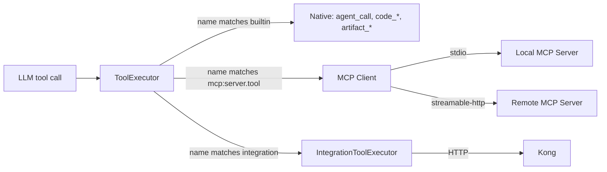

# 0010 — MCP as the canonical external tool plane

- **Status:** Accepted
- **Date:** 2026-04-24
- **Phase:** 3
- **Relates to:** 0002, 0004, 0011, 0013, 0014, 0020

## Context

ork's tool universe today is the hand-coded match arms in [`IntegrationToolExecutor`](../../crates/ork-integrations/src/tools.rs) (GitHub/GitLab activity, merged PRs, pipelines) plus the local workspace tools in [`CodeToolExecutor`](../../crates/ork-integrations/src/code_tools.rs). Adding any new external service requires a Rust PR that:

1. Implements a `SourceControlAdapter`-like trait or similar.
2. Adds a new arm in the `match tool_name` block.
3. Wires credentials into [`TenantSettings`](../../crates/ork-core/src/models/tenant.rs).
4. Documents the tool name and schema for prompt authors.

This blocks the parity goal at three levels:

- **No standard tool surface.** SAM exposes hundreds of community tools through MCP servers via Google ADK's [`MCPToolset`](https://github.com/SolaceLabs/solace-agent-mesh/blob/main/src/solace_agent_mesh/agent/sac/component.py); ork has none.
- **No tenant-scoped credentials in tool calls.** [`IntegrationToolExecutor::execute`](../../crates/ork-integrations/src/tools.rs) takes a `_tenant_id` parameter that is never read; tool credentials are global env vars. SAM's MCP integration scopes credentials per-agent.
- **Prompt-authors can't add tools without a Rust release.**

The platform constraint from the user is unambiguous: external services are reached through **MCP** when an MCP server exists, otherwise through **Kong-routed HTTP**.

## Decision

ork **adopts MCP as the canonical external tool plane** and adds an MCP **client** alongside the existing native tool executors. Tool resolution becomes a layered decision:



### New crate: `crates/ork-mcp`

Owns the MCP client implementation. Built on `rmcp` (the official Rust MCP SDK; we pin minor version to track upstream). Exposes:

```rust
pub struct McpClient {
    transports: HashMap<McpServerId, McpTransport>,
    session_pool: SessionPool,
    tool_cache: TtlCache<McpServerId, Vec<McpToolDescriptor>>,
}

pub enum McpTransport {
    Stdio { command: String, args: Vec<String>, env: HashMap<String, String> },
    StreamableHttp { url: Url, auth: McpAuth },
    Sse { url: Url, auth: McpAuth },     // legacy MCP transport
}

pub enum McpAuth {
    None,
    Bearer(SecretString),
    OAuth2(OAuth2Config),                 // mirrors A2A auth in ADR 0007
}

#[async_trait]
impl ToolExecutor for McpClient {
    async fn execute(&self, tenant_id: TenantId, tool_name: &str, input: &Value)
        -> Result<Value, OrkError>
    {
        let (server_id, tool) = parse_mcp_tool_name(tool_name)?;  // "mcp:atlassian.search_jira"
        let session = self.session_pool.acquire(&server_id, tenant_id).await?;
        let resp = session.call_tool(&tool, input).await?;
        Ok(resp.into_value())
    }
}
```

### Tool name convention

MCP tools are exposed under the `mcp:<server_id>.<tool_name>` namespace. For example a tool `search_jira` exported by an MCP server registered with id `atlassian` becomes `mcp:atlassian.search_jira`.

The colon-prefix lets [`CompositeToolExecutor`](../../crates/ork-integrations/src/tools.rs) route by prefix without name collisions:

```rust
impl ToolExecutor for CompositeToolExecutor {
    async fn execute(...) -> Result<Value, OrkError> {
        match tool_name {
            n if n.starts_with("mcp:") => self.mcp.execute(tenant_id, n, input).await,
            n if n == "agent_call" || n.starts_with("peer_") => self.builtin.execute(...).await,
            n if CodeToolExecutor::is_code_tool(n) => self.code.execute(...).await,
            _ => self.integration.execute(...).await,
        }
    }
}
```

### Server registration

Three sources, in priority order:

1. **Tenant config** (highest precedence): `TenantSettings.mcp_servers: Vec<McpServerConfig>` — per-tenant credentialed MCP servers (e.g. tenant-A's Jira instance vs tenant-B's). Stored encrypted in the existing `tenants.settings` JSONB column.
2. **Workflow inline**: a workflow YAML may declare a server scoped to a single run (useful for ephemeral MCP servers spawned by the workflow itself).
3. **Global config** ([`config/default.toml`](../../config/default.toml)): platform-wide servers (e.g. an MCP server fronting an internal data warehouse).

Example tenant config:

```yaml
mcp_servers:
  - id: atlassian
    transport:
      type: streamable_http
      url: https://mcp-atlassian.tenant-a.example.com
      auth:
        type: oauth2
        client_id: ...
        client_secret_env: ATLASSIAN_MCP_SECRET
  - id: local-fs
    transport:
      type: stdio
      command: mcp-fs
      args: ["--root", "/tenants/a/files"]
```

### Tool discovery and surfacing to the LLM

On startup and on every `mcp_refresh_interval` (default 5min), `McpClient` calls `tools/list` against each registered server and updates `tool_cache`. The cached descriptors are surfaced to ADR [`0011`](0011-native-llm-tool-calling.md)'s native tool calling: each tool becomes one entry in the LLM's tool list with a `name` of `mcp:<server>.<tool>` and the JSON Schema from the MCP server.

`AgentCard.skills` (ADR [`0003`](0003-a2a-protocol-model.md)) does **not** auto-include MCP tools — skills are agent-curated; tools are runtime details. Prompt authors choose which MCP tools each agent can use via the per-agent `tools:` allow-list (a glob like `mcp:atlassian.*`).

### When to use MCP vs Kong-routed HTTP

| Situation | Use |
| --------- | --- |
| Existing or actively-maintained MCP server for the service | **MCP** |
| Internal service with stable HTTP API and no MCP equivalent | **Kong route + new arm in `IntegrationToolExecutor`** |
| New internal service we own | **Build an MCP server** (per-service team's choice; we provide a template) |
| Service that requires bidirectional resource subscriptions | **MCP** (HTTP would force long-poll) |
| Service with strictly request/response and bulk data | **Kong + IntegrationToolExecutor** is fine |

`IntegrationToolExecutor` continues to exist for the second and fifth cases. Over time we expect the `IntegrationToolExecutor` arm count to shrink as more services grow MCP servers; the GitHub/GitLab arms can themselves be re-fronted by a community MCP server when stable.

### Security and tenant scoping

The `_tenant_id` parameter on [`ToolExecutor::execute`](../../crates/ork-core/src/workflow/engine.rs) finally has a use:

- Per-tenant MCP server pool: each tenant gets its own session-pool entries; credentials are never shared.
- For stdio servers, sub-processes run with the tenant's UID/cgroup if available (deferred; first cut runs single-user).
- For HTTP servers, OAuth tokens are cached per `(tenant_id, server_id)`.

This composes with ADR [`0020`](0020-tenant-security-and-trust.md)'s broader tenant model.

### Resources, prompts, and sampling

MCP also defines `resources` and `prompts`. We adopt **tools first** (the most-used MCP capability). Resources and prompts are stubbed in `crates/ork-mcp` and surfaced in a follow-up ADR once a concrete need lands. MCP `sampling` (server-initiated LLM calls) is intentionally **not** supported — it inverts trust boundaries we don't want today.

## Consequences

### Positive

- Adding a new external service goes from "Rust PR" to "MCP server config" — a tenant-admin task, not an ork-team task.
- Per-tenant credential isolation works correctly because every MCP call is scoped at the session-pool layer.
- ork inherits the MCP ecosystem (Atlassian, Stripe, GitHub, filesystem, browser, etc.) immediately.
- Internal teams can publish MCP servers behind Kong and ork picks them up via DevPortal-driven config.

### Negative / costs

- New crate + new external dependency (`rmcp`). MCP spec is not yet 1.0 in some clients; we pin a known-good version and re-test on bumps.
- stdio MCP servers are processes ork-api spawns; lifecycle management (kill on idle, restart on crash) adds operational surface. We address this with a session pool with idle eviction.
- Two ways to call HTTP services (MCP vs `IntegrationToolExecutor`) is mild cognitive load until the latter shrinks.

### Neutral / follow-ups

- ADR [`0011`](0011-native-llm-tool-calling.md) consumes the tool descriptors from `McpClient::list_tools()`.
- ADR [`0013`](0013-generic-gateway-abstraction.md) defines an "MCP gateway" mode: ork can be exposed **as** an MCP server in addition to A2A, mirroring [SAM's MCP gateway example](https://github.com/SolaceLabs/solace-agent-mesh/blob/main/examples/gateways/mcp_gateway_example.yaml).
- ADR [`0014`](0014-plugin-system.md) lets plugins register MCP servers programmatically.

## Alternatives considered

- **Skip MCP; use OpenAPI-described HTTP for everything.** Rejected: forces every external service to publish an OpenAPI spec ork can consume, and we lose the MCP ecosystem.
- **Embed MCP servers as in-process plugins.** Rejected: defeats MCP's process-isolation property.
- **Adopt LangChain-style tool wrappers.** Rejected: not Rust-native, and not interoperable with the wider MCP ecosystem.
- **Wait for `rmcp` to reach 1.0.** Rejected: we'd be permanently behind. Pin and test.

## Affected ork modules

- New crate: `crates/ork-mcp/` — `McpClient`, `SessionPool`, transports, descriptor cache.
- [`crates/ork-integrations/src/tools.rs`](../../crates/ork-integrations/src/tools.rs) — `CompositeToolExecutor` adds `mcp:` prefix routing.
- [`crates/ork-core/src/models/tenant.rs`](../../crates/ork-core/src/models/tenant.rs) — `TenantSettings.mcp_servers: Vec<McpServerConfig>`.
- [`crates/ork-persistence/src/postgres/tenant_repo.rs`](../../crates/ork-persistence/src/postgres/tenant_repo.rs) — encrypt/decrypt MCP secrets in JSONB.
- [`crates/ork-api/src/main.rs`](../../crates/ork-api/src/main.rs) — boot `McpClient` and inject into `CompositeToolExecutor`.
- [`config/default.toml`](../../config/default.toml) — `[mcp]` section with global servers + refresh interval.

## Mapping to SAM

| SAM concept | Where in SAM | ork equivalent in this ADR |
| ----------- | ------------ | -------------------------- |
| ADK `MCPToolset` | [`agent/sac/component.py`](https://github.com/SolaceLabs/solace-agent-mesh/blob/main/src/solace_agent_mesh/agent/sac/component.py) | `crates/ork-mcp::McpClient` |
| Custom SSL MCP session manager | [`agent/adk/ssl_mcp_session_manager.py`](https://github.com/SolaceLabs/solace-agent-mesh/blob/main/src/solace_agent_mesh/agent/adk/ssl_mcp_session_manager.py) | `McpClient::SessionPool` (TLS handled by `rmcp`) |
| MCP gateway example | [`examples/gateways/mcp_gateway_example.yaml`](https://github.com/SolaceLabs/solace-agent-mesh/blob/main/examples/gateways/mcp_gateway_example.yaml) | Tracked by ADR [`0013`](0013-generic-gateway-abstraction.md) |
| MCP OAuth callback path | [`shared/auth/middleware.py`](https://github.com/SolaceLabs/solace-agent-mesh/blob/main/src/solace_agent_mesh/shared/auth/middleware.py) | Mounted under `/api/mcp/oauth/callback` in [`crates/ork-api/src/routes/`](../../crates/ork-api/src/routes/) |

## Open questions

- Do we want to support MCP `prompts` and `resources` immediately? Decision: defer to a follow-up ADR; tools-only first cut.
- Should ork generate its own MCP server boilerplate so internal teams can stand up tools quickly? Defer; out of scope here.
- How are MCP tool errors mapped to A2A `TaskState::Failed` vs. structured tool-call errors? Decision: tool-call errors stay in the tool result (LLM can retry); transport / connection errors bubble up as step failures.

## Deferred from the v1 implementation

The first implementation in [`crates/ork-mcp`](../../crates/ork-mcp) lands the
`stdio` and `streamable-http` transports, the `mcp:<server>.<tool>` namespace,
and the per-`(tenant, server)` session pool, but explicitly defers the
following items to follow-up work — flagged in code with `TODO(ADR-0010)`:

- **MCP `resources`, `prompts`, and `sampling`.** [`McpClient`](../../crates/ork-mcp/src/client.rs) only exposes `tools/list` and `tools/call`. The other MCP capabilities are stubbed at the API surface; ADR-0011 will revisit `prompts` and `sampling` once native tool calling lands.
- **Workflow inline MCP servers.** [`McpConfigSources`](../../crates/ork-mcp/src/client.rs) consults the global `[mcp.servers]` set and (eventually) `TenantSettings.mcp_servers`; the third source from §`Server registration` (workflow inline overlay) is wired as a stub that always returns `None`. The follow-up will hook it into the engine's existing inline-card resolver.
- **Per-tenant `TenantSettings.mcp_servers` overlay.** [`TenantSettings`](../../crates/ork-core/src/models/tenant.rs) now owns the field and [`PgTenantRepository::update_settings`](../../crates/ork-persistence/src/postgres/tenant_repo.rs) persists it, but `McpConfigSources::resolve` still ignores tenant overrides. The follow-up will plug the tenant repo into `McpConfigSources` so per-tenant URLs and credentials win over the globals.
- **Per-agent allow-list globs (`mcp:atlassian.*`).** Descriptors today are tenant-scoped only; per-agent filtering belongs to ADR-0011 alongside the LLM-facing tool catalog.
- **Real envelope encryption of MCP secrets at rest.** Today secrets live in env vars referenced by `*_env` config fields. The full encrypted-at-rest path is owned by ADR-0020.
- **Legacy `sse` transport with a dedicated `SseClientTransport`.** `rmcp` 0.16 dropped the standalone SSE client transport, so the [`McpTransportConfig::Sse`](../../crates/ork-mcp/src/config.rs) variant is currently routed through the same `StreamableHttpClientTransport` as `streamable_http` (with a one-shot `tracing::warn!` at connect time). When `rmcp` re-exposes a standalone SSE transport this will switch back without an ADR change.

## References

- MCP spec: <https://modelcontextprotocol.io/>
- `rmcp` crate (Rust MCP SDK): <https://crates.io/crates/rmcp>
- SAM ADK setup: <https://github.com/SolaceLabs/solace-agent-mesh/blob/main/src/solace_agent_mesh/agent/adk/setup.py>
