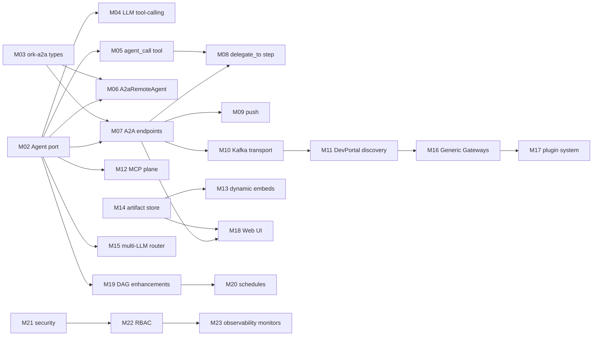

# 0023 — Migration & rollout plan

- **Status:** Proposed
- **Date:** 2026-04-24
- **Phase:** 4
- **Relates to:** all preceding ADRs (0001 – 0022)
- **Supersedes:** [`future-a2a.md`](../../future-a2a.md) (rollout sketch portion only)

## Context

The set of ADRs `0001`–`0022` describes a substantial reshaping of the ork workspace. Many of the decisions touch overlapping modules — for example, the `Agent` port (ADR [`0002`](0002-agent-port.md)) is a precondition for native LLM tool-calling (ADR [`0011`](0011-native-llm-tool-calling.md)), peer delegation (ADR [`0006`](0006-peer-delegation.md)), the A2A server endpoints (ADR [`0008`](0008-a2a-server-endpoints.md)), the generic gateway abstraction (ADR [`0013`](0013-generic-gateway-abstraction.md)), and the Web UI (ADR [`0017`](0017-webui-chat-client.md)). Without a sequence, contributors will trip over half-finished refactors, the workspace will have long red-CI windows, and operators will struggle to reason about which features are safe to enable.

We need an ordering that:

1. Lands load-bearing abstractions first (so subsequent ADRs do not invalidate each other).
2. Keeps each PR independently mergeable behind a feature flag.
3. Preserves backwards compatibility for the existing CLI, REST API, and persisted state until each replacement is validated.
4. Provides explicit cutover and deprecation milestones, not "and then we delete the old code someday".

## Decision

ork **adopts the rollout sequence below**, expressed as 23 numbered milestones (M01 – M23). Each milestone is one ADR or a tightly-scoped slice of one ADR. Each milestone ships behind a Cargo feature or a runtime config flag and includes a rollback path. CI gates and deprecation windows are explicit.

### Milestone sequence

| # | Milestone | Ships | Feature flag | Rollback |
| - | --------- | ----- | ------------ | -------- |
| M01 | ADR [`0001`](0001-adr-process-and-conventions.md) | ADR repo conventions | n/a | n/a |
| M02 | ADR [`0002`](0002-agent-port.md) — `Agent` port + `LocalAgent` | `crates/ork-core/src/ports/agent.rs`, `LocalAgent`, refactor `WorkflowEngine::execute_agent_step` to use `Arc<dyn Agent>` | `--features agent-port` (default on at GA) | revert single PR; engine still has the inlined call site |
| M03 | ADR [`0003`](0003-a2a-protocol-model.md) — `ork-a2a` crate, A2A types | `crates/ork-a2a` published as path dep | n/a (additive) | revert; nothing depends on it yet |
| M04 | ADR [`0011`](0011-native-llm-tool-calling.md) — native LLM tool-calling for `LocalAgent` | extends `LlmProvider` trait, rewrites `LocalAgent::send_stream` to be tool-call native | `[llm.tool_calling] = true` (default on per provider where supported) | per-provider opt-out flag falls back to `auto_invoke=false` semantics |
| M05 | ADR [`0006`](0006-peer-delegation.md) **slice A** — `agent_call` tool | `agent_call` registered with `LocalAgent`'s `ToolExecutor` | `[delegation.agent_call] = true` | tool is not advertised when flag is off |
| M06 | ADR [`0007`](0007-remote-a2a-agent-client.md) — `A2aRemoteAgent` | `crates/ork-integrations/src/a2a_client.rs`, registry support | `[discovery.remote_agents] = true` | registry only contains local agents when off |
| M07 | ADR [`0008`](0008-a2a-server-endpoints.md) — A2A JSON-RPC + SSE endpoints, `a2a_tasks` + `a2a_messages` tables | `crates/ork-api/src/routes/a2a.rs`; migrations 002, 003 | `[a2a.server] = true` | route mounted only when on |
| M08 | ADR [`0006`](0006-peer-delegation.md) **slice B** — `delegate_to` workflow step | extends `WorkflowStep`, parent↔child link | `[delegation.workflow_step] = true` | parser ignores field when off (deserialize rejects with helpful error if used while off) |
| M09 | ADR [`0009`](0009-push-notifications.md) — push notifications + webhook signing + JWKS | `a2a_push_configs` table, outbox topic, JWS signer | `[a2a.push] = true` | push registration RPC returns "not enabled" |
| M10 | ADR [`0004`](0004-hybrid-kong-kafka-transport.md) — Kafka transport for discovery + status + push | `crates/ork-eventing` Kafka producer/consumer | `[transport.kafka] = true` | when off, status broadcasts only via Redis (degraded mode) |
| M11 | ADR [`0005`](0005-agent-card-and-devportal-discovery.md) — agent card endpoint + DevPortal sync | well-known routes, `AgentRegistry` TTL + heartbeat producer | `[discovery.devportal] = true` | well-known route is always served; DevPortal push is opt-in |
| M12 | ADR [`0010`](0010-mcp-tool-plane.md) — MCP tool plane | `crates/ork-mcp`, `McpToolExecutor` adapter | `[mcp] = true` | empty server list = no tools |
| M13 | ADR [`0015`](0015-dynamic-embeds.md) — dynamic embed resolver | `crates/ork-core/src/embeds/` | `[embeds] = true` | when off, `«…»` is left literal |
| M14 | ADR [`0016`](0016-artifact-storage.md) — artifact storage trait + tools + backends | `crates/ork-core/src/ports/artifact_store.rs`, `crates/ork-storage`, `artifacts` table | `[artifacts] = true` | tools not registered when off |
| M15 | ADR [`0012`](0012-multi-llm-providers.md) — multi-LLM router | `crates/ork-llm/src/router.rs`, per-tenant provider config | `[llm.router] = true`; off keeps single-provider path | provider trait lookup falls back to MinimaxProvider |
| M16 | ADR [`0013`](0013-generic-gateway-abstraction.md) — `Gateway` trait + REST adapter | `crates/ork-core/src/ports/gateway.rs`, `crates/ork-gateways/rest` | `[gateways.rest] = true` | gateways only registered when on |
| M17 | ADR [`0014`](0014-plugin-system.md) — plugin manifest + `ork plugin add` | CLI subcommand, `plugins/` discovery, lockfile | `[plugins] = true` | binary built without the feature has no `plugin` subcommand |
| M18 | ADR [`0017`](0017-webui-chat-client.md) — Web UI gateway + SPA | `crates/ork-webui`, `client/webui/frontend` | `[webui] = true` | route not mounted when off |
| M19 | ADR [`0018`](0018-dag-executor-enhancements.md) — DAG executor enhancements (parallel/switch/map/loop) | `crates/ork-core/src/workflow/{engine,compiler}.rs` | `[workflow.advanced_steps] = true`; off rejects new step kinds at parse time | additive; old `step` kind unchanged |
| M20 | ADR [`0019`](0019-scheduled-tasks.md) — scheduled tasks (persisted + REST + leader election) | `WorkflowScheduler` integration, migration 006, `/api/schedules` | `[scheduler] = true` | when off, scheduler does not start |
| M21 | ADR [`0020`](0020-tenant-security-and-trust.md) — tenant security + trust | RLS enforcement, JWT claim extension, KMS, Kafka SASL | `[security.rls] = true`; flagged but **on by default in production** | dev-mode flag disables RLS for local debugging only |
| M22 | ADR [`0021`](0021-rbac-scopes.md) — RBAC scopes | scope vocabulary, `ScopeChecker`, route + agent + tool checks | `[security.rbac] = true`; default-deny for new scopes; default-allow for legacy paths during a 60-day window | per-scope opt-out via `[security.rbac.legacy_open]` list |
| M23 | ADR [`0022`](0022-observability.md) — observability (tracing, metrics, monitors, audit, task events) | OTLP, Prometheus, monitors, migrations 008/009 | `[observability.*]` per pillar | each pillar individually toggleable |

### Cutovers and deprecations

The plan explicitly retires four legacy paths. Each retirement gates on telemetry from M23 to confirm the new path is healthy.

| Deprecation | Replaced by | Trigger | Final removal milestone |
| ----------- | ----------- | ------- | ----------------------- |
| `LlmProvider` direct dispatch in `WorkflowEngine` | `Arc<dyn Agent>` (M02) | M02 + 30 days, zero error rate diff | bundled with M02 PR; only `feature = "legacy-direct-llm"` retains it for one release |
| `AgentRole` enum 4-way switch | open `AgentId(String)` (M02) | when no workflow YAML in the corpus references the enum | next minor release after M02 |
| Pre-execute-and-append tool loop | native LLM tool-calling (M04) | when `[llm.tool_calling] = true` is the default for all in-tree providers | M04 + 60 days |
| Global per-process rate limiter middleware | `RateLimitMonitor` per agent (M23) | when monitor metrics show coverage of all routes | M23 + 30 days |

### Breaking change policy

- **Workflow YAML.** New step kinds (M19) and `delegate_to` (M08) are additive and parsed only when their flag is on. Existing fields are not renamed.
- **Persisted state.** Migrations are forward-only; each new table has its own migration. No rename or destructive migration ships in the M01-M23 sequence. A future ADR may consolidate.
- **REST API.** New routes are added under `/api/...` or `/.well-known/...`; existing routes keep their request/response shapes. Where SAM-style behaviour replaces ork legacy behaviour, the legacy path is preserved behind a `Deprecation` header for one minor version.
- **CLI.** `ork plugin` (M17) is additive. Other CLI commands keep their flags; a new `--rbac-scopes-required` flag is opt-in.
- **JWT claim shape.** The extension in M21 is additive; the legacy `tenant_id` claim continues to be honoured for one major version. New `tid_chain`, `scopes`, `trust_tier`, `trust_class` are tolerated when missing, then required after the deprecation window.

### CI and gating per milestone

Every milestone PR must pass these gates before merge:

- `cargo fmt --check`, `cargo clippy --all-targets -- -D warnings`, `cargo test --workspace`.
- A migration test that runs `migrations/*.sql` against an empty database and asserts schema compatibility.
- An ADR consistency check (small script under `tools/adr_check.rs`) that:
  - Verifies the ADR file referenced in the PR description exists and is in `Accepted` or `Proposed` state.
  - Verifies the PR does not modify a file outside the "Affected ork modules" list of the ADR (or, when it must, requires a checkbox in the PR template explaining why).
- For runtime-flagged milestones, the tests run twice — flag on and flag off — to prove backwards compatibility.

### Feature-flag bookkeeping

A single `[features]` table in [`config/default.toml`](../../config/default.toml) holds the runtime flags. The `OrkConfig` loader logs a single line per flag at startup. After a milestone is GA, the flag's default is flipped to `true`, and the per-deployment opt-out remains for one more release before removal.

Cargo features mirror the runtime flags only when conditional compilation is justified (e.g. excluding a backend dependency). Most milestones use runtime flags only.

### Per-tenant rollout

Deployments can opt subsets of tenants into a milestone before flipping the global default. The mechanism is the existing [`TenantSettings`](../../crates/ork-core/src/models/tenant.rs) struct, extended with a `feature_overrides: HashMap<String, bool>`. The configuration loader merges global → per-tenant. ADR [`0020`](0020-tenant-security-and-trust.md) covers RLS for the override tables.

### Observability gates

Each rollout step checks the metrics defined in ADR [`0022`](0022-observability.md):

- M04 tracks `ork_llm_tokens_total` parity vs the legacy path.
- M07/M10 watch `ork_kafka_publish_lag_seconds`, `ork_sse_event_lag_seconds`, `ork_a2a_request_duration_seconds` p95.
- M21/M22 watch `ork_audit_denied_total` to spot RBAC regressions.

A milestone is considered "soaked" once a configurable observation window passes with no SLO violations attributable to the change.

### Documentation milestones

For each milestone above, the PR also updates:

- The ADR's `Status:` field to `Accepted` (with a date).
- The README index in [`docs/adrs/README.md`](README.md) (status legend table).
- A short entry in `CHANGELOG.md` (created in M01) under the milestone version heading.

## Consequences

### Positive

- Each PR is small enough to review and revert; large refactors land in slices that respect a known DAG.
- Operators get a clear list of feature flags and the order to enable them in.
- Backwards compatibility is preserved through documented deprecation windows rather than sudden breaks.
- Observability lands last but doesn't block earlier milestones — they emit the right shape of data from the start.

### Negative

- 23 milestones is a lot of process. The discipline pays off only if maintainers respect the sequencing and don't shortcut by mixing milestones in one PR.
- Feature flags accumulate temporarily; the deprecation table commits to retiring them.

### Neutral

- The plan does not require a code freeze; unrelated work can land between milestones provided it doesn't violate the dependency order.
- The plan can be re-sequenced by a future ADR if a milestone proves harder than expected; the dependency arrows below are the constraints, not the order itself.

## Dependency graph (informative)

## Alternatives considered

- **Big-bang rebase.** Rejected: too risky, no rollback story, hard to review.
- **Strict ADR-numerical order.** Rejected: ADR numbers are stable identifiers, not a rollout sequence; ADR 0010 (MCP) for example does not need to wait for ADR 0009 (push).
- **Skip feature flags, rely on branches.** Rejected: long-running branches diverge, and operators cannot opt in granularly.
- **Single observability milestone first.** Rejected: telemetry is more useful when emitting from real new code; we land observability last but design earlier milestones to emit the right metrics names from the start.

## Affected ork modules

This ADR is meta. It affects the **process** more than any single file, but produces these concrete artefacts:

- New: `tools/adr_check.rs` — ADR consistency check used in CI.
- New: `CHANGELOG.md` — created in M01.
- [`config/default.toml`](../../config/default.toml) — `[features]` table.
- [`crates/ork-core/src/models/tenant.rs`](../../crates/ork-core/src/models/tenant.rs) — `feature_overrides`.
- [`docs/adrs/README.md`](README.md) — phase + status table updated as milestones land.

## Mapping to SAM

| SAM concept | Where in SAM | ork equivalent in this ADR |
| ----------- | ------------ | -------------------------- |
| Release process | SAM uses standard semver releases | M01 + per-milestone gating |
| Plugin SDK rollout | `sam plugin` evolved over multiple SAM versions | M17 lands in one milestone, behind a flag |
| Solace-coupled assumptions baked into SAM | every layer | retired by M07–M11; the "no Solace" rule is enforced via feature flags rather than a single deletion PR |

## Open questions

- Exact observation window per milestone before promoting to default-on. Default proposal: 14 days in `staging`, 7 days in one production tenant, then global flip.
- CHANGELOG format: keep human-curated or generate from PR titles? Proposed: human-curated with a section per milestone.
- Whether to publish a public GA marker (e.g. tag `v1.0.0`) only after M23 or after a curated subset (M02–M11). Decision deferred to a marketing-adjacent ADR.

## References

- All ADRs `0001` – `0022`.
- [`future-a2a.md`](../../future-a2a.md) (rollout sketch superseded for the rollout portion only).
- ["Migrations" pattern, Martin Fowler](https://martinfowler.com/bliki/ParallelChange.html).
