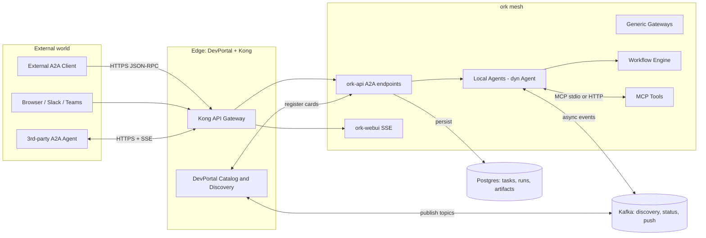
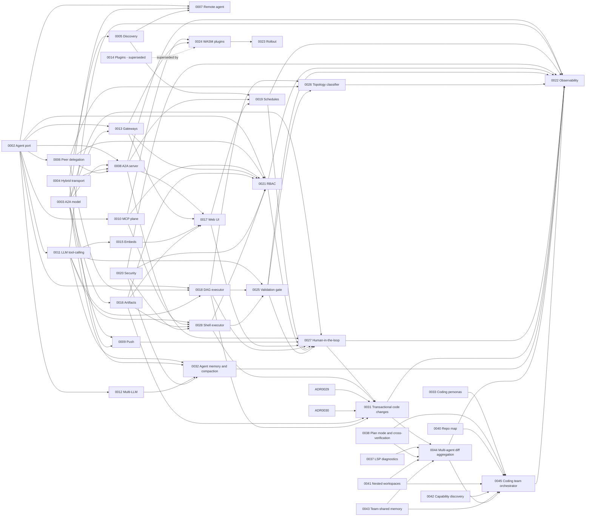

# ork Architecture Decision Records

This directory contains the Architecture Decision Records (ADRs) that describe how the Rust `ork` workspace will evolve to reach feature parity with [Solace Agent Mesh (SAM)](https://github.com/SolaceLabs/solace-agent-mesh) without using the Solace broker, while keeping all agents compliant with the [Agent2Agent (A2A) protocol](https://github.com/google/a2a).

ADRs are immutable once accepted: subsequent decisions either supersede them or relate to them. To propose a change to an accepted decision, write a new ADR that supersedes it.

## Status legend

| Badge | Meaning |
| ----- | ------- |
| Proposed | Drafted, under review, not yet adopted |
| Accepted | Adopted; implementations should follow it |
| Superseded by NNNN | Replaced by a newer ADR (see link) |
| Deprecated | No longer in force; not yet replaced |

## How to add a new ADR

1. Copy [`0000-template.md`](0000-template.md) to `NNNN-<slug>.md` where `NNNN` is the next available number.
2. Fill in every section. Cite at least one [ork](../../) file path and at least one SAM equivalent.
3. Open a PR with status **Proposed**. The reviewer flips it to **Accepted** at merge time.
4. Add the row to the index below.

See [`0001-adr-process-and-conventions.md`](0001-adr-process-and-conventions.md) for the long-form process.

## Cross-cutting principles

- **A2A-first.** Every ork agent — local or remote — must satisfy the A2A protocol surface (cards, tasks, messages, parts, streaming, cancel, push). Tracked by [`0002`](0002-agent-port.md) and [`0003`](0003-a2a-protocol-model.md).
- **No Solace.** SAM's broker-coupled pieces are remapped to **Kong** (HTTP/SSE) and **Kafka** (async/event mesh). The team's **DevPortal** is the registry / catalog surface that replaces Solace's `discovery/>` wildcards and a standalone Kong dev portal.
- **MCP for external tools.** External systems flow through MCP servers (or, when no MCP server exists, through Kong-routed HTTP). Internal tools stay native Rust under [`ToolExecutor`](../../crates/ork-integrations/src/tools.rs).
- **Backwards-compatible migration.** Every ADR identifies the load-bearing PR and the smallest viable next step. The full sequence lives in [`0023-migration-and-rollout-plan.md`](0023-migration-and-rollout-plan.md). (Historical context that seeded these ADRs lived in `future-a2a.md`, which has been retired now that the work is fully captured by the ADR set.)

## Glossary

| Term | Meaning in this ADR set |
| ---- | ----------------------- |
| **A2A** | Google's open Agent2Agent protocol: Agent Cards, Tasks, Messages with typed Parts (Text/Data/File), JSON-RPC + SSE transport. |
| **Agent Card** | The JSON document at `/.well-known/agent-card.json` that advertises an agent's name, skills, IO modes, auth schemes and endpoint URLs. |
| **DevPortal** | The team's existing developer portal that combines Solace-style event catalog and Kong-style API catalog into one source of truth for both Kafka topics and HTTP endpoints. |
| **Kong** | API gateway used as the single HTTPS ingress for all `ork-api`, `ork-webui`, A2A and MCP traffic. Provides mTLS, OAuth2, rate limits, schema enforcement. |
| **Kafka** | Async / event mesh used in place of Solace topics for discovery heartbeats, streaming task status, push notifications, fire-and-forget delegation. |
| **MCP** | Model Context Protocol; a stdio/HTTP protocol for exposing tools and resources to LLM agents. ork acts as an MCP **client**. |
| **SAM** | [Solace Agent Mesh](https://github.com/SolaceLabs/solace-agent-mesh): the reference Python framework whose features ork is matching. |
| **SAC** | Solace AI Connector — the SAM-internal runtime that we are deliberately not porting. |
| **Local agent** | An agent whose `dyn Agent` implementation runs in-process inside ork. |
| **Remote A2A agent** | An agent reached over the wire via A2A JSON-RPC + SSE; may be in another ork mesh, a vendor, or a third party. |
| **Task** | The A2A unit of work, mapped 1:1 to ork's [`WorkflowRun`](../../crates/ork-core/src/models/workflow.rs). |

## Reference architecture

## Phases

The ADRs are grouped into four phases that mirror a sensible rollout order. Phase boundaries are encoded in the ADR numbering.

| Phase | ADR range | Theme |
| ----- | --------- | ----- |
| 1 | 0001 – 0005 | Foundations: ADR process, `Agent` port, A2A model, hybrid transport, discovery |
| 2 | 0006 – 0009 | Mesh capabilities: peer delegation, remote agent client, A2A server, push notifications |
| 3 | 0010 – 0016 | External & extensibility: MCP, native tool calling, multi-LLM, gateways, plugins, embeds, artifacts |
| 4 | 0017 – 0023 | Surfaces, security, ops: Web UI, DAG enhancements, scheduling, tenant security, RBAC, observability, rollout |

## Index

| # | Title | Status | Phase |
| - | ----- | ------ | ----- |
| [0000](0000-template.md) | Template | n/a | n/a |
| [0001](0001-adr-process-and-conventions.md) | ADR process and repository conventions | Accepted | 1 |
| [0002](0002-agent-port.md) | Introduce an `Agent` port in `ork-core` | Accepted | 1 |
| [0003](0003-a2a-protocol-model.md) | Adopt the A2A 1.0 protocol and message model | Implemented | 1 |
| [0004](0004-hybrid-kong-kafka-transport.md) | Hybrid A2A transport: Kong/HTTP+SSE for sync, Kafka for async | Proposed | 1 |
| [0005](0005-agent-card-and-devportal-discovery.md) | Agent Card publishing and DevPortal-backed discovery | Proposed | 1 |
| [0006](0006-peer-delegation.md) | Peer delegation: `agent_call` tool and `delegate` workflow step | Accepted | 2 |
| [0007](0007-remote-a2a-agent-client.md) | Remote agent client (`A2aRemoteAgent`) | Accepted | 2 |
| [0008](0008-a2a-server-endpoints.md) | A2A server endpoints in `ork-api` | Proposed | 2 |
| [0009](0009-push-notifications.md) | Push notifications and webhook signing | Proposed | 2 |
| [0010](0010-mcp-tool-plane.md) | MCP as the canonical external tool plane | Accepted | 3 |
| [0011](0011-native-llm-tool-calling.md) | Native LLM tool-calling | Accepted | 3 |
| [0012](0012-multi-llm-providers.md) | OpenAI-compatible LLM provider catalog | Accepted | 3 |
| [0013](0013-generic-gateway-abstraction.md) | Generic Gateway abstraction | Implemented | 3 |
| [0014](0014-plugin-system.md) | Plugin system | Superseded by [0024](0024-wasm-plugin-system.md) | 3 |
| [0015](0015-dynamic-embeds.md) | Dynamic embeds | Implemented | 3 |
| [0016](0016-artifact-storage.md) | Artifact / file-management service | Accepted | 3 |
| [0017](0017-webui-chat-client.md) | Web UI / chat client gateway | Accepted | 4 |
| [0018](0018-dag-executor-enhancements.md) | Workflow DAG executor enhancements | Proposed | 4 |
| [0019](0019-scheduled-tasks.md) | Scheduled tasks | Proposed | 4 |
| [0020](0020-tenant-security-and-trust.md) | Tenant security and A2A trust model | Proposed | 4 |
| [0021](0021-rbac-scopes.md) | RBAC scopes for agents, tools, artifacts | Proposed | 4 |
| [0022](0022-observability.md) | Observability: tracing, monitors, task event log | Proposed | 4 |
| [0023](0023-migration-and-rollout-plan.md) | Migration and rollout plan | Proposed | 4 |
| [0024](0024-wasm-plugin-system.md) | WASM-based plugin system | Proposed | 3 |
| [0025](0025-typed-output-validation-and-verifier-agent.md) | Typed-output validation and verifier-agent port | Proposed | 4 |
| [0026](0026-workflow-topology-selection-from-task-features.md) | Workflow topology selection from task features (classifier) | Proposed | 4 |
| [0027](0027-human-in-the-loop.md) | Human-in-the-loop: approval steps and input requests | Proposed | 4 |
| [0028](0028-shell-executor-and-test-runners.md) | Shell executor and test-runner integration | Proposed | 3 |
| [0029](0029-workspace-file-editor.md) | Workspace file editor and patch application | Proposed | 4 |
| [0030](0030-git-operations.md) | Git operations and worktree management | Proposed | 3 |
| [0031](0031-transactional-code-changes.md) | Transactional code changes and rollback | Proposed | 4 |
| [0032](0032-agent-memory-and-context-compaction.md) | Agent memory and context compaction | Proposed | 4 |
| [0033](0033-coding-agent-personas.md) | Coding agent personas and solo reference | Proposed | 4 |
| [0034](0034-per-model-capability-profiles.md) | Per-model capability profiles | Proposed | 4 |
| [0035](0035-constrained-decoding.md) | Constrained decoding for tool calls | Proposed | 4 |
| [0037](0037-lsp-diagnostics.md) | LSP diagnostics as a feedback source | Proposed | 4 |
| [0038](0038-plan-mode-and-cross-verification.md) | Plan mode and A2A plan cross-verification | Proposed | 4 |
| [0039](0039-agent-tool-call-hooks.md) | Agent tool-call hooks | Proposed | 4 |
| [0040](0040-repo-map.md) | Repo map for code-aware context priming | Proposed | 4 |
| [0041](0041-nested-workspaces.md) | Nested workspaces and sub-worktree coordination | Proposed | 4 |
| [0042](0042-capability-discovery.md) | Capability-tagged agent discovery for coding teams | Proposed | 4 |
| [0043](0043-team-shared-memory.md) | Team-scoped shared memory and decision log | Proposed | 4 |
| [0044](0044-multi-agent-diff-aggregation.md) | Multi-agent transactional diff aggregation | Proposed | 4 |
| [0045](0045-coding-team-orchestrator.md) | Coding team orchestrator (architect agent) | Proposed | 4 |

## Decision graph

The arrows below summarise each ADR's `Relates to` field. A → B means "A is a precondition or close collaborator of B". The migration sequence in [`0023`](0023-migration-and-rollout-plan.md) is one valid topological order over this graph.

## Mapping-to-SAM summary

Each ADR carries its own detailed `Mapping to SAM` section. The matrix below is the index of "what SAM concept does this ADR replace or restate?".

| ADR | Replaces / restates this SAM concept |
| --- | ------------------------------------ |
| [0002](0002-agent-port.md) | `SamAgentComponent`, `BaseAgentComponent` |
| [0003](0003-a2a-protocol-model.md) | `common/a2a/types.py` |
| [0004](0004-hybrid-kong-kafka-transport.md) | Solace topic plane in `common/a2a/protocol.py`, replaced by Kong + Kafka |
| [0005](0005-agent-card-and-devportal-discovery.md) | `common/agent_registry.py`, agent card endpoints, `discovery/>` wildcards |
| [0006](0006-peer-delegation.md) | `agent/tools/peer_agent_tool.py` |
| [0007](0007-remote-a2a-agent-client.md) | SAM remote-agent equivalents, RPC client wrappers |
| [0008](0008-a2a-server-endpoints.md) | SAM A2A endpoints + task lifecycle |
| [0009](0009-push-notifications.md) | `common/utils/push_notification_auth.py` |
| [0010](0010-mcp-tool-plane.md) | SAM `MCPToolset` and remote-tool plumbing |
| [0011](0011-native-llm-tool-calling.md) | ADK-native tool calling inside `SamAgentComponent` |
| [0012](0012-multi-llm-providers.md) | SAM litellm-style multi-provider config (handled out-of-process via Kong + GPUStack) |
| [0013](0013-generic-gateway-abstraction.md) | `gateway/generic/component.py` |
| [0014](0014-plugin-system.md) | (superseded by [0024](0024-wasm-plugin-system.md)) |
| [0024](0024-wasm-plugin-system.md) | `sam plugin` SDK + plugin manifest, reframed as a WASM/wasmtime sandboxed runtime |
| [0015](0015-dynamic-embeds.md) | SAM `«type:expression»` resolver pipeline |
| [0016](0016-artifact-storage.md) | SAM `ArtifactService` + artifact tools |
| [0017](0017-webui-chat-client.md) | SAM Web UI gateway (`client/webui/`) |
| [0018](0018-dag-executor-enhancements.md) | `WorkflowExecutorComponent` + `DAGExecutor` |
| [0019](0019-scheduled-tasks.md) | SAM scheduled-task surface |
| [0020](0020-tenant-security-and-trust.md) | SAM tenant + trust assumptions, distributed across config |
| [0021](0021-rbac-scopes.md) | SAM scope-string conventions checked at gateways |
| [0022](0022-observability.md) | `agent/utils/monitors.py`, SAM logging + audit |
| [0023](0023-migration-and-rollout-plan.md) | n/a — process ADR |

