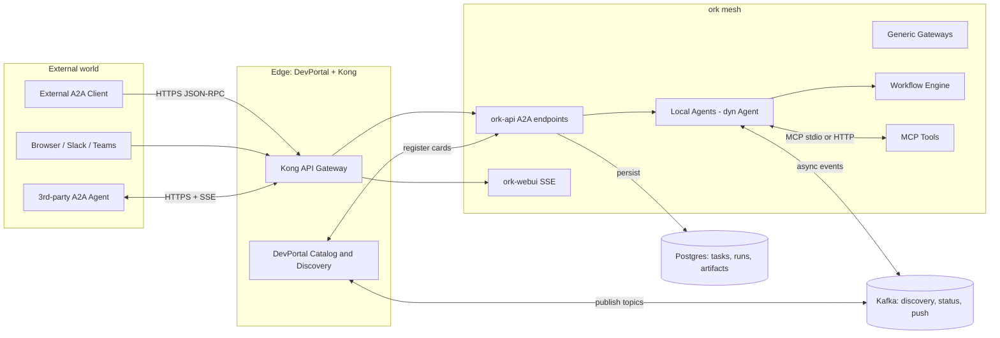
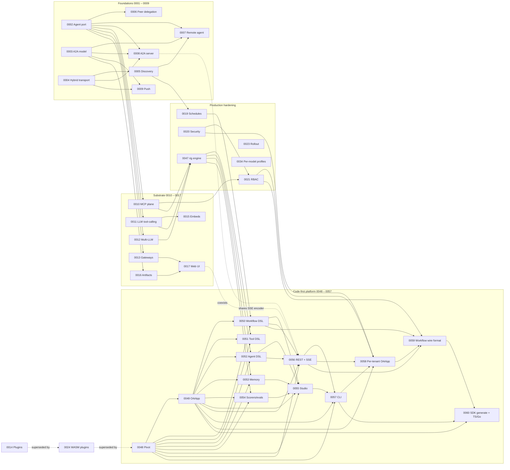

# ork Architecture Decision Records

This directory contains the Architecture Decision Records (ADRs) for the Rust `ork` workspace.

ork is a **code-first agent platform** with an [A2A](https://github.com/google/a2a) wire surface. After [ADR 0048](0048-pivot-to-code-first-rig-platform.md) the platform is shaped after [Mastra](https://mastra.ai/docs) (developer-facing API: `OrkApp`-style central registry, typed workflows, code-first tools and agents, Studio, REST+SSE server) on top of [`rig-core`](https://docs.rs/rig-core/latest/rig/) as the per-agent engine ([ADR 0047](0047-rig-as-local-agent-engine.md)). The original parity target was [Solace Agent Mesh (SAM)](https://github.com/SolaceLabs/solace-agent-mesh) with Solace replaced by Kong + Kafka; ADRs 0001 – 0023 carry that history and the substrate they describe still ships.

ADRs are immutable once accepted: subsequent decisions either supersede them or relate to them. To propose a change to an accepted decision, write a new ADR that supersedes it.

## Status legend

| Badge | Meaning |
| ----- | ------- |
| Proposed | Drafted, under review, not yet adopted |
| Accepted | Adopted; implementations should follow it |
| Superseded by NNNN | Replaced by a newer ADR (see link) |
| Deprecated | No longer in force; not yet replaced |

## How to add a new ADR

1. Copy [`0000-template.md`](0000-template.md) to `NNNN-<slug>.md` where `NNNN` is the next available number.
2. Fill in every section. Cite at least one [ork](../../) file path and at least one SAM equivalent.
3. Open a PR with status **Proposed**. The reviewer flips it to **Accepted** at merge time.
4. Add the row to the index below.

See [`0001-adr-process-and-conventions.md`](0001-adr-process-and-conventions.md) for the long-form process.

## Cross-cutting principles

- **A2A-first.** Every ork agent — local or remote — must satisfy the A2A protocol surface (cards, tasks, messages, parts, streaming, cancel, push). Tracked by [`0002`](0002-agent-port.md) and [`0003`](0003-a2a-protocol-model.md). The code-first builder in [`0052`](0052-code-first-agent-dsl.md) produces values that satisfy this port automatically.
- **Code-first composition.** A user assembles an ork application by registering typed agents, workflows, tools, and memory in a single Rust value (`OrkApp`, see [`0049`](0049-orkapp-central-registry.md)). The auto-generated REST + SSE surface (`/api/agents/:id`, `/api/workflows/:id`, see [`0056`](0056-auto-generated-rest-and-sse-surface.md)), Studio ([`0055`](0055-studio-local-dev-ui.md)), and `ork dev` ([`0057`](0057-ork-cli-dev-build-start.md)) all read off that value.
- **rig as the per-agent engine.** Inside an agent, [`rig-core`](https://docs.rs/rig-core/latest/rig/) drives the LLM-and-tool dance; ork keeps the protocol layer (cards, tasks, federation) above it. See [`0047`](0047-rig-as-local-agent-engine.md), [`0052`](0052-code-first-agent-dsl.md).
- **No Solace.** Sync traffic goes through **Kong** (HTTP/SSE), async through **Kafka**. The team's **DevPortal** is the registry / catalog surface that replaces Solace's `discovery/>` wildcards and a standalone Kong dev portal.
- **MCP for external tools.** External systems flow through MCP servers (or, when no MCP server exists, through Kong-routed HTTP). Internal tools are typed Rust values built with the [`0051`](0051-code-first-tool-dsl.md) DSL on top of [`rig::tool::Tool`](https://docs.rs/rig-core/latest/rig/tool/index.html).
- **Hexagonal boundaries.** Domain logic in `ork-core`, `ork-agents`, `ork-workflow`, `ork-tool`, `ork-memory`, `ork-eval` does not depend on `axum`, `sqlx`, `reqwest`, `rmcp`, or `rskafka` directly — adapters live in gateway-shaped crates (`ork-api`, `ork-studio`, `ork-webui`, `ork-persistence`, `ork-mcp`).

## Glossary

| Term | Meaning in this ADR set |
| ---- | ----------------------- |
| **A2A** | Google's open Agent2Agent protocol: Agent Cards, Tasks, Messages with typed Parts (Text/Data/File), JSON-RPC + SSE transport. |
| **Agent Card** | The JSON document at `/.well-known/agent-card.json` that advertises an agent's name, skills, IO modes, auth schemes and endpoint URLs. |
| **DevPortal** | The team's existing developer portal that combines Solace-style event catalog and Kong-style API catalog into one source of truth for both Kafka topics and HTTP endpoints. |
| **Kong** | API gateway used as the single HTTPS ingress for all `ork-api`, `ork-webui`, A2A and MCP traffic. Provides mTLS, OAuth2, rate limits, schema enforcement. |
| **Kafka** | Async / event mesh used in place of Solace topics for discovery heartbeats, streaming task status, push notifications, fire-and-forget delegation. |
| **MCP** | Model Context Protocol; a stdio/HTTP protocol for exposing tools and resources to LLM agents. ork acts as an MCP **client**. |
| **SAM** | [Solace Agent Mesh](https://github.com/SolaceLabs/solace-agent-mesh): the reference Python framework whose features ork is matching. |
| **SAC** | Solace AI Connector — the SAM-internal runtime that we are deliberately not porting. |
| **Local agent** | An agent whose `dyn Agent` implementation runs in-process inside ork. |
| **Remote A2A agent** | An agent reached over the wire via A2A JSON-RPC + SSE; may be in another ork mesh, a vendor, or a third party. |
| **Task** | The A2A unit of work, mapped 1:1 to ork's [`WorkflowRun`](../../crates/ork-core/src/models/workflow.rs). |

## Reference architecture

## Phases

The ADRs are grouped into phases that mirror a sensible rollout order. Phase boundaries are encoded in the ADR numbering, with one renumbering after the [`0048`](0048-pivot-to-code-first-rig-platform.md) pivot.

| Phase | ADR range | Theme |
| ----- | --------- | ----- |
| 1 | 0001 – 0009 | Foundations: ADR process, `Agent` port, A2A model, hybrid transport, discovery, peer delegation, remote agent client, A2A server, push notifications |
| 2 | 0010 – 0017 | Substrate: MCP, native tool calling, multi-LLM router, generic gateways, embeds, artifacts, Web UI |
| 3 | 0019 – 0023, 0034, 0047 | Production hardening: scheduling, security, RBAC, rollout, per-model profiles, rig as local-agent engine |
| 4 | 0048 – 0060 | Code-first platform pivot: `OrkApp`, code-first DSLs (workflow, tool, agent), memory, scorers, Studio, REST+SSE server, `ork dev`/`build`/`start` CLI, per-tenant `OrkApp`, declarative workflow wire format, polyglot SDKs |
| – | 0018, 0024 – 0033, 0035 – 0046 | Superseded — see Status column in the index below |

## Index

| # | Title | Status | Phase |
| - | ----- | ------ | ----- |
| [0000](0000-template.md) | Template | n/a | n/a |
| [0001](0001-adr-process-and-conventions.md) | ADR process and repository conventions | Accepted | 1 |
| [0002](0002-agent-port.md) | Introduce an `Agent` port in `ork-core` | Accepted | 1 |
| [0003](0003-a2a-protocol-model.md) | Adopt the A2A 1.0 protocol and message model | Implemented | 1 |
| [0004](0004-hybrid-kong-kafka-transport.md) | Hybrid A2A transport: Kong/HTTP+SSE for sync, Kafka for async | Proposed | 1 |
| [0005](0005-agent-card-and-devportal-discovery.md) | Agent Card publishing and DevPortal-backed discovery | Proposed | 1 |
| [0006](0006-peer-delegation.md) | Peer delegation: `agent_call` tool and `delegate` workflow step | Accepted | 2 |
| [0007](0007-remote-a2a-agent-client.md) | Remote agent client (`A2aRemoteAgent`) | Accepted | 2 |
| [0008](0008-a2a-server-endpoints.md) | A2A server endpoints in `ork-api` | Proposed | 2 |
| [0009](0009-push-notifications.md) | Push notifications and webhook signing | Proposed | 2 |
| [0010](0010-mcp-tool-plane.md) | MCP as the canonical external tool plane | Accepted | 3 |
| [0011](0011-native-llm-tool-calling.md) | Native LLM tool-calling | Accepted | 3 |
| [0012](0012-multi-llm-providers.md) | OpenAI-compatible LLM provider catalog | Accepted | 3 |
| [0013](0013-generic-gateway-abstraction.md) | Generic Gateway abstraction | Implemented | 3 |
| [0014](0014-plugin-system.md) | Plugin system | Superseded by [0024](0024-wasm-plugin-system.md) | 3 |
| [0015](0015-dynamic-embeds.md) | Dynamic embeds | Implemented | 3 |
| [0016](0016-artifact-storage.md) | Artifact / file-management service | Accepted | 3 |
| [0017](0017-webui-chat-client.md) | Web UI / chat client gateway | Accepted | 2 |
| [0018](0018-dag-executor-enhancements.md) | Workflow DAG executor enhancements | Superseded by [0050](0050-code-first-workflow-dsl.md) | – |
| [0019](0019-scheduled-tasks.md) | Scheduled tasks | Proposed | 3 |
| [0020](0020-tenant-security-and-trust.md) | Tenant security and A2A trust model | Implemented | 3 |
| [0021](0021-rbac-scopes.md) | RBAC scopes for agents, tools, artifacts | Accepted | 3 |
| [0022](0022-observability.md) | Observability: tracing, monitors, task event log | Superseded by [0048](0048-pivot-to-code-first-rig-platform.md) | – |
| [0023](0023-migration-and-rollout-plan.md) | Migration and rollout plan | Proposed | 3 |
| [0024](0024-wasm-plugin-system.md) | WASM-based plugin system | Superseded by [0048](0048-pivot-to-code-first-rig-platform.md) | – |
| [0025](0025-typed-output-validation-and-verifier-agent.md) | Typed-output validation and verifier-agent port | Superseded by [0052](0052-code-first-agent-dsl.md) | – |
| [0026](0026-workflow-topology-selection-from-task-features.md) | Workflow topology selection from task features (classifier) | Superseded by [0050](0050-code-first-workflow-dsl.md) | – |
| [0027](0027-human-in-the-loop.md) | Human-in-the-loop: approval steps and input requests | Superseded by [0050](0050-code-first-workflow-dsl.md) | – |
| [0028](0028-shell-executor-and-test-runners.md) | Shell executor and test-runner integration | Superseded by [0048](0048-pivot-to-code-first-rig-platform.md) | – |
| [0029](0029-workspace-file-editor.md) | Workspace file editor and patch application | Superseded by [0048](0048-pivot-to-code-first-rig-platform.md) | – |
| [0030](0030-git-operations.md) | Git operations and worktree management | Superseded by [0048](0048-pivot-to-code-first-rig-platform.md) | – |
| [0031](0031-transactional-code-changes.md) | Transactional code changes and rollback | Superseded by [0048](0048-pivot-to-code-first-rig-platform.md) | – |
| [0032](0032-agent-memory-and-context-compaction.md) | Agent memory and context compaction | Superseded by [0053](0053-memory-working-and-semantic.md) | – |
| [0033](0033-coding-agent-personas.md) | Coding agent personas and solo reference | Superseded by [0052](0052-code-first-agent-dsl.md) | – |
| [0034](0034-per-model-capability-profiles.md) | Per-model capability profiles | Proposed | 3 |
| [0035](0035-constrained-decoding.md) | Constrained decoding for tool calls | Superseded by [0048](0048-pivot-to-code-first-rig-platform.md) | – |
| [0036](0036-per-step-model-assignment.md) | Per-step model assignment and cross-agent composition | Superseded by [0048](0048-pivot-to-code-first-rig-platform.md) | – |
| [0037](0037-lsp-diagnostics.md) | LSP diagnostics as a feedback source | Superseded by [0048](0048-pivot-to-code-first-rig-platform.md) | – |
| [0038](0038-plan-mode-and-cross-verification.md) | Plan mode and A2A plan cross-verification | Superseded by [0048](0048-pivot-to-code-first-rig-platform.md) | – |
| [0039](0039-agent-tool-call-hooks.md) | Agent tool-call hooks | Superseded by [0052](0052-code-first-agent-dsl.md) | – |
| [0040](0040-repo-map.md) | Repo map for code-aware context priming | Superseded by [0048](0048-pivot-to-code-first-rig-platform.md) | – |
| [0041](0041-nested-workspaces.md) | Nested workspaces and sub-worktree coordination | Superseded by [0048](0048-pivot-to-code-first-rig-platform.md) | – |
| [0042](0042-capability-discovery.md) | Capability-tagged agent discovery for coding teams | Superseded by [0048](0048-pivot-to-code-first-rig-platform.md) | – |
| [0043](0043-team-shared-memory.md) | Team-scoped shared memory and decision log | Superseded by [0053](0053-memory-working-and-semantic.md) | – |
| [0044](0044-multi-agent-diff-aggregation.md) | Multi-agent transactional diff aggregation | Superseded by [0048](0048-pivot-to-code-first-rig-platform.md) | – |
| [0045](0045-coding-team-orchestrator.md) | Coding team orchestrator (architect agent) | Superseded by [0048](0048-pivot-to-code-first-rig-platform.md) | – |
| [0046](0046-evaluation-harness-and-regression-corpus.md) | Evaluation harness and regression corpus | Superseded by [0054](0054-live-scorers-and-eval-corpus.md) | – |
| [0047](0047-rig-as-local-agent-engine.md) | Adopt `rig-core` as the local-agent engine | Accepted | 3 |
| [0048](0048-pivot-to-code-first-rig-platform.md) | Strategic pivot to a code-first platform on rig | Accepted | 4 |
| [0049](0049-orkapp-central-registry.md) | `OrkApp` central registry: code-first project entry point | Accepted | 4 |
| [0050](0050-code-first-workflow-dsl.md) | Code-first Workflow DSL with typed steps and suspend/resume | Implemented | 4 |
| [0051](0051-code-first-tool-dsl.md) | Code-first Tool DSL on `rig::Tool` with typed Args/Output | Accepted | 4 |
| [0052](0052-code-first-agent-dsl.md) | Code-first Agent DSL on `rig::Agent` with structured outputs | Implemented | 4 |
| [0053](0053-memory-working-and-semantic.md) | Memory: working memory + semantic recall, threads and resources | Implemented | 4 |
| [0054](0054-live-scorers-and-eval-corpus.md) | Live scorers and offline eval corpus | Proposed | 4 |
| [0055](0055-studio-local-dev-ui.md) | Studio: local dev UI for chat, workflows, memory, traces, scorers | Proposed | 4 |
| [0056](0056-auto-generated-rest-and-sse-surface.md) | Auto-generated REST + SSE server surface for agents and workflows | Proposed | 4 |
| [0057](0057-ork-cli-dev-build-start.md) | `ork dev` / `ork build` / `ork start` CLI | Proposed | 4 |
| [0058](0058-per-tenant-orkapp.md) | Per-tenant `OrkApp` and tenant-scoped catalog overlays | Proposed | 4 |
| [0059](0059-declarative-workflow-wire-format.md) | Declarative workflow wire format, dynamic registration, and Rust loader | Proposed | 4 |
| [0060](0060-ork-sdk-generate-and-reference-sdks.md) | `ork sdk generate` and reference TS / Go workflow SDKs | Proposed | 4 |

## Decision graph

A → B means "A is a precondition or close collaborator of B". Superseded clusters (0018, 0024 – 0046 minus 0034) are omitted; their headers carry the explicit successor.

## Prior art / parity references summary

Each ADR carries its own detailed `Prior art / parity references` section (or, for the older ADRs, a `Mapping to SAM` block). The matrix below is the index of "which external concept does this ADR restate, replace, or build on?".

| ADR | External concept restated / replaced / built on |
| --- | ----------------------------------------------- |
| [0002](0002-agent-port.md) | SAM `SamAgentComponent`, `BaseAgentComponent` |
| [0003](0003-a2a-protocol-model.md) | A2A spec; SAM `common/a2a/types.py` |
| [0004](0004-hybrid-kong-kafka-transport.md) | Solace topic plane → Kong + Kafka |
| [0005](0005-agent-card-and-devportal-discovery.md) | SAM `common/agent_registry.py`; A2A agent-card discovery |
| [0006](0006-peer-delegation.md) | SAM `agent/tools/peer_agent_tool.py` |
| [0007](0007-remote-a2a-agent-client.md) | A2A remote-client; SAM RPC wrappers |
| [0008](0008-a2a-server-endpoints.md) | A2A endpoints + task lifecycle |
| [0009](0009-push-notifications.md) | A2A push-notification auth; SAM `push_notification_auth.py` |
| [0010](0010-mcp-tool-plane.md) | MCP spec; SAM `MCPToolset` |
| [0011](0011-native-llm-tool-calling.md) | OpenAI tool-calling spec; ADK-native tool calling |
| [0012](0012-multi-llm-providers.md) | OpenAI-compatible `/v1/chat/completions`; LiteLLM (out-of-process) |
| [0013](0013-generic-gateway-abstraction.md) | SAM `gateway/generic/component.py` |
| [0015](0015-dynamic-embeds.md) | SAM `«type:expression»` resolver |
| [0016](0016-artifact-storage.md) | SAM `ArtifactService` |
| [0017](0017-webui-chat-client.md) | SAM Web UI gateway |
| [0019](0019-scheduled-tasks.md) | SAM scheduled-task surface; Mastra workflow triggers |
| [0020](0020-tenant-security-and-trust.md) | SAM tenant + trust assumptions |
| [0021](0021-rbac-scopes.md) | SAM scope-string conventions |
| [0023](0023-migration-and-rollout-plan.md) | n/a — process ADR |
| [0034](0034-per-model-capability-profiles.md) | LiteLLM model-card metadata; rig provider clients |
| [0047](0047-rig-as-local-agent-engine.md) | [`rig-core`](https://docs.rs/rig-core/latest/rig/) `AgentBuilder`, `Tool`, `Extractor` |
| [0048](0048-pivot-to-code-first-rig-platform.md) | Mastra platform shape; rig engine |
| [0049](0049-orkapp-central-registry.md) | Mastra `Mastra` class |
| [0050](0050-code-first-workflow-dsl.md) | Mastra `createWorkflow` / `createStep`; LangGraph `StateGraph` |
| [0051](0051-code-first-tool-dsl.md) | Mastra `createTool`; rig `rig::tool::Tool` |
| [0052](0052-code-first-agent-dsl.md) | Mastra `Agent`; rig `AgentBuilder` + `Extractor` |
| [0053](0053-memory-working-and-semantic.md) | Mastra Memory; LangGraph `Store` |
| [0054](0054-live-scorers-and-eval-corpus.md) | Mastra evals + scorers; LangSmith datasets |
| [0055](0055-studio-local-dev-ui.md) | Mastra Studio |
| [0056](0056-auto-generated-rest-and-sse-surface.md) | Mastra Hono server (`/api/agents/:id`, `/api/workflows/:id`) |
| [0057](0057-ork-cli-dev-build-start.md) | Mastra CLI (`mastra dev/build/start/init/eval`) |
| [0058](0058-per-tenant-orkapp.md) | Auth0 / Temporal namespaces — per-tenant overlay on a shared catalog |
| [0059](0059-declarative-workflow-wire-format.md) | Conductor / Argo Workflows JSON DSL; CEL for predicates |
| [0060](0060-ork-sdk-generate-and-reference-sdks.md) | OpenAPI Generator (one schema → N clients); Drizzle / Prisma proxy-based emission |

